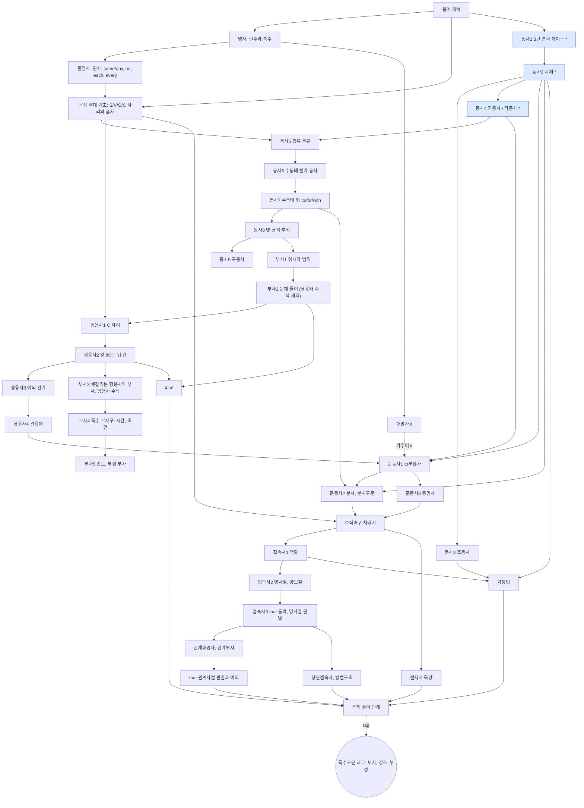

# Roadmap

Auto-generated by `tools/validate.py --mermaid`. Do not edit.
`*` = prototype 1 content node.

```mermaid
graph TD
  base_terms["용어 해석"]
  noun_number["명사, 단수와 복수"]
  noun_determiner["한정사: 관사, some/any, no, each, every"]
  noun_pronoun_it["대명사 it"]
  skeleton_svoc["문장 뼈대 기초: S/V/O/C 자리와 품사"]
  verb_inflection["동사1 3단 변화 게이트 *"]
  verb_tense["동사2 시제 *"]
  verb_modal["동사3 조동사"]
  verb_transitivity["동사4 자동사 / 타동사 *"]
  verb_type["동사5 종류 분류"]
  verb_no_passive["동사6 수동태 불가 동사"]
  verb_passive_prep["동사7 수동태 뒤 to/for/with"]
  verb_pattern["동사8 몇 형식 추적"]
  verb_phrasal["동사9 구동사"]
  adv_scope["부사1 위치와 범위"]
  adv_drill["부사2 문제 풀이 (형용사 수식 제외)"]
  adv_confusable["부사3 헷갈리는 형용사와 부사, 형용사 수식"]
  adv_special["부사4 특수 부사구: 시간, 조건"]
  adv_freq_neg["부사5 빈도, 부정 부사"]
  adj_complement["형용사1 C 자리"]
  adj_position["형용사2 앞 짧은, 뒤 긴"]
  adj_exception["형용사3 예외 암기"]
  adj_idiom["형용사4 관용어"]
  verbal_to_inf["준동사1 to부정사"]
  verbal_participle["준동사2 분사, 분사구문"]
  verbal_gerund["준동사3 동명사"]
  trim_modifier["수식어구 쳐내기"]
  conj_role["접속사1 역할"]
  conj_noun_concessive["접속사2 명사절, 양보절"]
  conj_that_noun["접속사3 that 동격, 명사절 판별"]
  conj_correlative["상관접속사, 병렬구조"]
  rel_basic["관계대명사, 관계부사"]
  rel_that_exception["that 관계사절 판별과 예외"]
  comp_basic["비교"]
  hyp_basic["가정법"]
  prep_special["전치사 특강"]
  solve_stage["문제 풀이 단계"]
  tag_special(("특수구문 태그: 도치, 강조, 부정"))
  base_terms --> noun_number
  noun_number --> noun_determiner
  noun_number --> noun_pronoun_it
  noun_pronoun_it -.가주어 it.-> verbal_to_inf
  base_terms --> skeleton_svoc
  noun_determiner --> skeleton_svoc
  base_terms --> verb_inflection
  verb_inflection --> verb_tense
  verb_tense --> verb_modal
  verb_tense --> verb_transitivity
  verb_transitivity --> verb_type
  skeleton_svoc --> verb_type
  verb_type --> verb_no_passive
  verb_no_passive --> verb_passive_prep
  verb_passive_prep --> verb_pattern
  verb_pattern --> verb_phrasal
  verb_pattern --> adv_scope
  adv_scope --> adv_drill
  adv_drill --> adj_complement
  skeleton_svoc --> adj_complement
  adj_complement --> adj_position
  adj_position --> adj_exception
  adj_exception --> adj_idiom
  adj_position --> adv_confusable
  adv_confusable --> adv_special
  adv_special --> adv_freq_neg
  verb_tense --> verbal_to_inf
  verb_transitivity --> verbal_to_inf
  adj_idiom --> verbal_to_inf
  verbal_to_inf --> verbal_participle
  verb_passive_prep --> verbal_participle
  verb_tense --> verbal_participle
  verbal_to_inf --> verbal_gerund
  verbal_participle --> trim_modifier
  verbal_gerund --> trim_modifier
  skeleton_svoc --> trim_modifier
  trim_modifier --> conj_role
  conj_role --> conj_noun_concessive
  conj_noun_concessive --> conj_that_noun
  conj_that_noun --> rel_basic
  rel_basic --> rel_that_exception
  conj_that_noun --> conj_correlative
  adj_position --> comp_basic
  adv_drill --> comp_basic
  verb_tense --> hyp_basic
  verb_modal --> hyp_basic
  conj_role --> hyp_basic
  trim_modifier --> prep_special
  prep_special --> solve_stage
  rel_that_exception --> solve_stage
  conj_correlative --> solve_stage
  comp_basic --> solve_stage
  hyp_basic --> solve_stage
  solve_stage -.tag.-> tag_special
  classDef proto1 fill:#dbeafe,stroke:#1d4ed8
  class verb_inflection,verb_tense,verb_transitivity proto1
```
